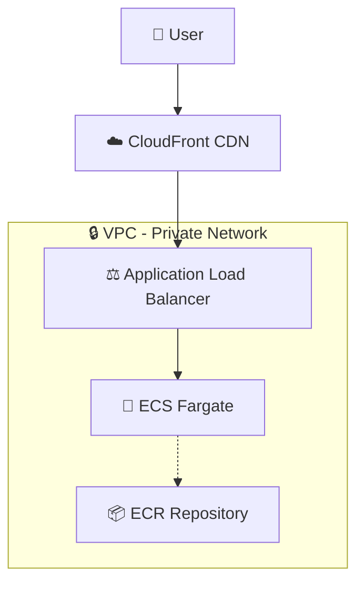
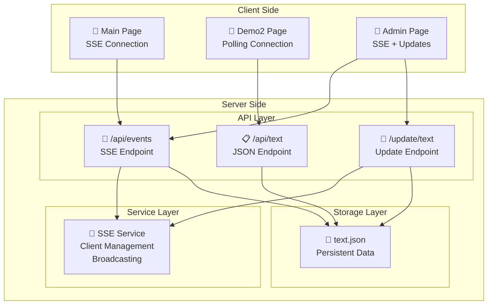
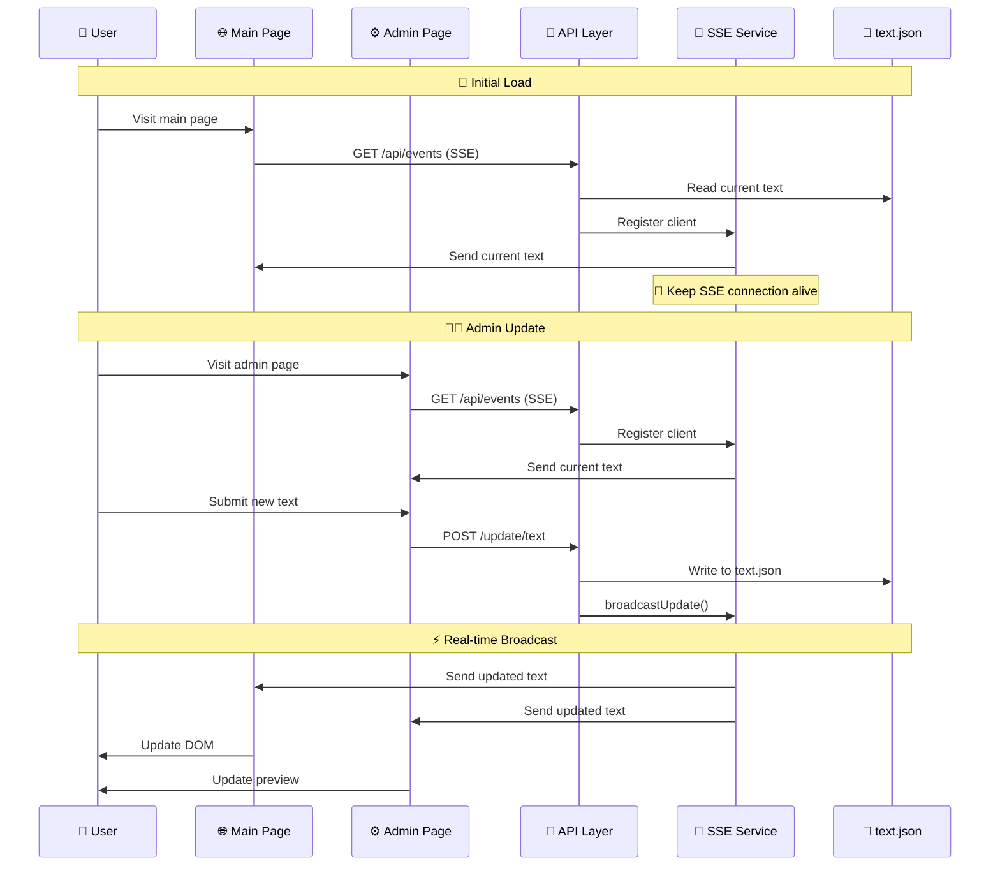

# Astro Dynamic Text - Real-time Text Update Application

A modern real-time web application built with **Astro.js** that demonstrates **Server-Sent Events (SSE)** for live text updates without page refreshes.

## 🎯 Project Goal

Create a simple yet powerful demonstration of real-time communication between client and server using:
- **Server-Side Rendering (SSR)** with Astro.js
- **Server-Sent Events (SSE)** for real-time updates
- **RESTful API** for text updates
- **Persistent data storage** using JSON files
- **AWS Cloud deployment** with full containerization

## 🌟 Features

- **Real-time Updates**: Text changes are instantly broadcast to all connected clients
- **Admin Interface**: Clean, intuitive admin panel for updating text
- **Persistent Storage**: Text data survives server restarts
- **Automatic Reconnection**: SSE connections automatically reconnect on failure
- **Responsive Design**: Bootstrap-based responsive UI
- **Cloud Deployment**: Fully containerized and deployed on AWS

## 🏗️ Infrastructure Architecture



## 🔧 Application Architecture



## 🔄 Application Flow



## 🚀 Live Demo

### Full SSR Solution (Real-time with SSE)
**Application URL**: https://d1jk0h2l40omp5.cloudfront.net

**Pages:**
- **Main Page** (`/`): Displays the dynamic text with real-time updates using SSE
- **Demo2 Page** (`/demo2`): Simple polling approach (updates every 3 seconds)
- **Admin Page** (`/admin`): Interface to update the text in real-time

### Simplest Alternative Solution (S3 + CloudFront)
**Application URL**: https://simplest-alternative-944473419677-us-west-2.s3.us-west-2.amazonaws.com/index.html

**Features:**
- ✅ **Same functionality**: Displays dynamic text that updates without redeploy
- ✅ **Same UI**: Identical Bootstrap styling and user experience
- ✅ **Cost optimized**: $0.10-$0.60/month vs $25-$35/month
- ⚡ **Update method**: S3 file upload instead of real-time SSE
- 📁 **Source code**: Available in `/simplest-alternative/` directory

## 🔄 Two Approaches Demonstrated

This application demonstrates **two different approaches** for real-time text updates:

### 1. Server-Sent Events (SSE) - Main Demo (`/`)
**Real-time push-based updates**

✅ **Advantages:**
- **Instant updates** - Changes appear immediately (< 100ms)
- **Efficient** - Only sends data when changes occur
- **Real-time** - True push-based communication
- **Lower bandwidth** - No unnecessary requests

⚠️ **Challenges:**
- **Memory management** - Persistent connections can accumulate
- **Connection handling** - Requires proper cleanup and reconnection logic
- **Scaling complexity** - Need to manage connection limits and cleanup
- **Browser compatibility** - Some older browsers have limitations

### 2. Simple Polling - Demo2 (`/demo2`)
**Interval-based HTTP requests**

✅ **Advantages:**
- **Simple to implement** - Just `fetch()` in `setInterval()`
- **No memory leaks** - Each request is independent and self-contained
- **Universal compatibility** - Works in all browsers and environments
- **Predictable resource usage** - Easy to calculate server load
- **Easy debugging** - Standard HTTP requests in dev tools

⚠️ **Trade-offs:**
- **Delayed updates** - Up to 3 second delay for changes to appear
- **Less efficient** - Makes requests even when no changes occur
- **Higher server load** - Constant requests from all clients
- **More bandwidth usage** - Regular requests regardless of data changes

### When to Use Each Approach:

**Use SSE (Main Demo)** when:
- You need instant updates (< 1 second)
- Update frequency is unpredictable
- You have the infrastructure to handle persistent connections
- Real-time user experience is critical

**Use Polling (Demo2)** when:
- Simplicity is more important than instant updates
- Updates are infrequent (every few seconds is acceptable)
- You want to avoid connection management complexity
- You need broad compatibility and easy debugging

## 🛠️ Technology Stack

- **Frontend**: Astro.js (SSR), Bootstrap 5, Vanilla JavaScript
- **Backend**: Astro API Routes (Node.js)
- **Real-time**: Server-Sent Events (SSE)
- **Storage**: JSON file system
- **Container**: Docker (multi-stage build)
- **Cloud**: AWS ECS Fargate, CloudFront, Application Load Balancer
- **Infrastructure**: AWS CDK (TypeScript)

## 📋 API Endpoints

### GET `/api/events`
Server-Sent Events endpoint for real-time updates
- **Response**: `text/event-stream`
- **Data Format**: `{"dynamicString": "current text"}`
- **Features**: Auto-reconnection, client management via SSE service

### GET `/api/text`
Simple API endpoint for polling approach
- **Response**: `application/json`
- **Data Format**: `{"dynamicString": "current text"}`
- **Cache Headers**: No-cache for fresh data

### POST `/update/text`
Update the dynamic text
- **Body**: `{"text": "new text value"}`
- **Response**: `{"success": true, "message": "Text updated successfully"}`
- **Side Effect**: Broadcasts update to all SSE clients

## 🐳 Docker Deployment

The application uses a multi-stage Docker build for optimization:

```dockerfile
# Dependencies stage (production only)
FROM node:20-alpine AS deps
RUN npm ci --only=production

# Build stage (full dependencies + build)
FROM node:20-alpine AS builder
COPY --from=deps /app/node_modules ./node_modules
RUN npm run build

# Runtime stage (minimal)
FROM node:20-alpine AS runner
COPY --from=deps /app/node_modules ./node_modules
COPY --from=builder /app/dist ./dist
CMD ["node", "./dist/server/entry.mjs"]
```

## 💰 AWS Deployment Cost

**💡 Quick Summary:** Running SSE or simple GET endpoints on AWS ECS Fargate costs about the same — pricing depends on container uptime, not request type.

### Monthly Cost Breakdown:

**ECS Fargate (0.25 vCPU + 0.5 GB)**: ≈ $7/month (24/7)
**Application Load Balancer + Data Transfer**: ≈ $15–25/month

**Total: ≈ $25–35/month** for 24/7 uptime

### SSE vs GET Endpoints:
- **Nearly identical cost** for compute and load balancing
- SSE might add a few dollars only if streaming large data or handling thousands of concurrent clients
- Both approaches use the same container resources and ALB capacity

## 🚀 Deployment

The application includes automated deployment scripts:

```bash
# Full deployment
./infra/deploy.sh

# Individual steps
./infra/deploy-infra.sh  # Deploy AWS infrastructure
./infra/build-push.sh    # Build and push Docker image
./infra/update-ecs.sh    # Update ECS service
```

## 🔧 Local Development

```bash
# Install dependencies
npm install

# Start development server
npm run dev

# Build for production
npm run build

# Preview production build
npm run preview
```

## 📁 Project Structure

```
src/
├── pages/
│   ├── index.astro          # Main page (SSE demo)
│   ├── demo2.astro          # Simple polling demo
│   ├── admin.astro          # Admin interface
│   ├── api/
│   │   ├── events.ts        # SSE endpoint
│   │   └── text.ts          # JSON API endpoint
│   └── update/
│       └── text.ts          # Update API endpoint
├── services/
│   └── sse-service.ts       # SSE client management
├── data/
│   └── text.json            # Persistent text storage
infra/
├── lib/
│   └── infra-stack.ts       # AWS CDK infrastructure
├── deploy.sh                # Main deployment script
├── build-push.sh           # Docker build and push
└── deploy-infra.sh         # Infrastructure deployment
```

## 🎮 How It Works

1. **User visits main page** → Server reads `text.json` and renders initial content
2. **JavaScript establishes SSE connection** → Client connects to `/events` endpoint
3. **Admin updates text** → POST request to `/update/text` updates file and broadcasts
4. **All connected clients receive update** → Text updates in real-time without refresh
5. **Persistent storage** → Text survives server restarts via JSON file

## 🌟 Key Features Demonstrated

- **Server-Side Rendering (SSR)** with Astro.js
- **Real-time bidirectional communication** using SSE
- **RESTful API design** for updates
- **Persistent data storage** without databases
- **Responsive web design** with Bootstrap
- **Cloud-native deployment** on AWS
- **Container orchestration** with ECS
- **Global content delivery** via CloudFront
- **Infrastructure as Code** using AWS CDK

---

*Built with ❤️ using Astro.js and deployed on AWS*