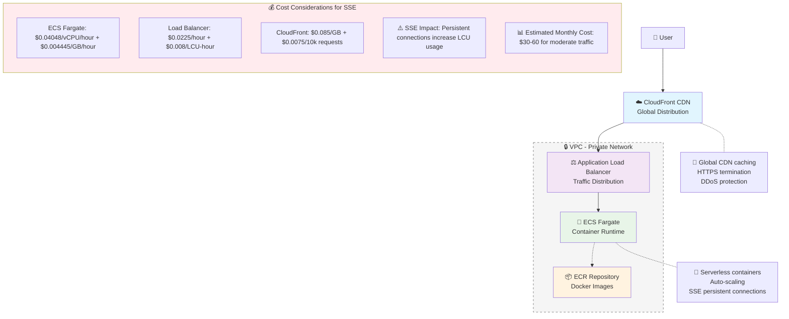
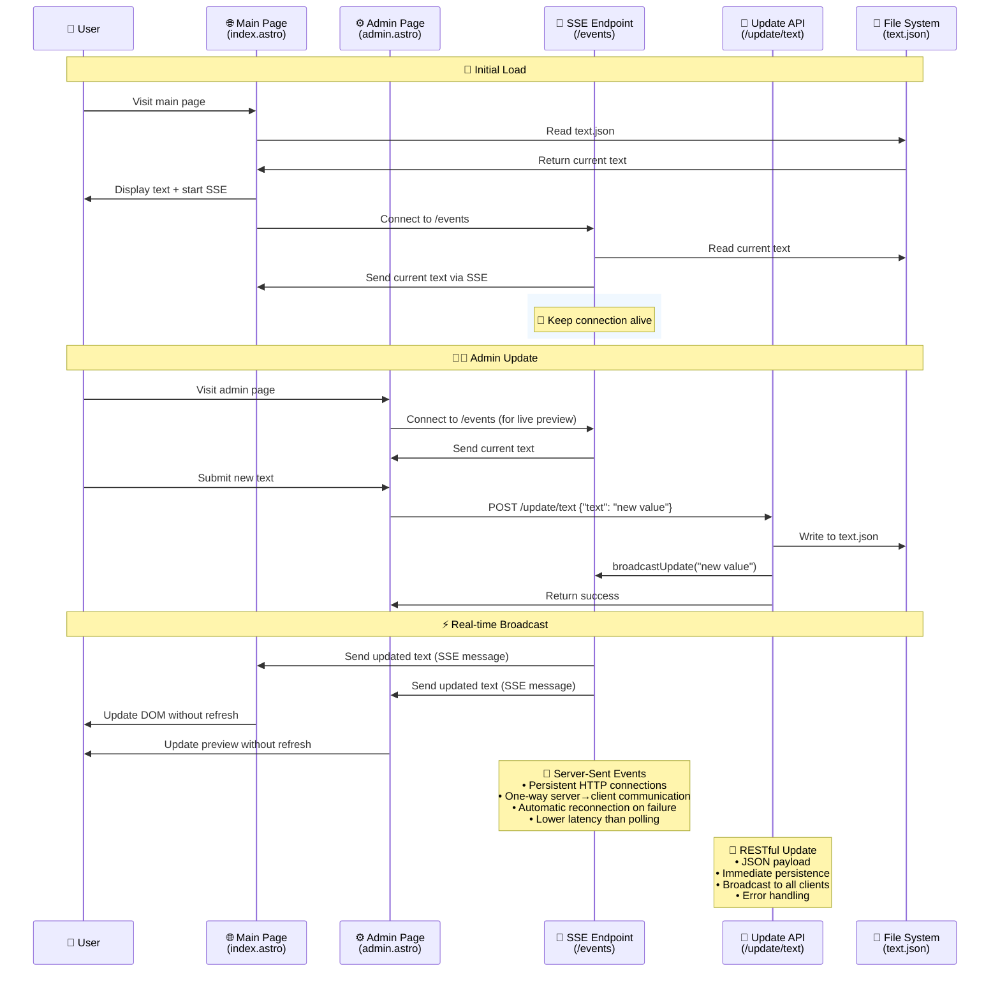

# Astro Dynamic Text - Real-time Text Update Application

A modern real-time web application built with **Astro.js** that demonstrates **Server-Sent Events (SSE)** for live text updates without page refreshes.

## 🎯 Project Goal

Create a simple yet powerful demonstration of real-time communication between client and server using:
- **Server-Side Rendering (SSR)** with Astro.js
- **Server-Sent Events (SSE)** for real-time updates
- **RESTful API** for text updates
- **Persistent data storage** using JSON files
- **AWS Cloud deployment** with full containerization

## 🌟 Features

- **Real-time Updates**: Text changes are instantly broadcast to all connected clients
- **Admin Interface**: Clean, intuitive admin panel for updating text
- **Persistent Storage**: Text data survives server restarts
- **Automatic Reconnection**: SSE connections automatically reconnect on failure
- **Responsive Design**: Bootstrap-based responsive UI
- **Cloud Deployment**: Fully containerized and deployed on AWS

## 🏗️ Architecture Overview



## 🔄 Application Flow



## 🚀 Live Demo

**Application URL**: https://d1jk0h2l40omp5.cloudfront.net

### Pages:
- **Main Page** (`/`): Displays the dynamic text with real-time updates
- **Admin Page** (`/admin`): Interface to update the text in real-time

## 🛠️ Technology Stack

- **Frontend**: Astro.js (SSR), Bootstrap 5, Vanilla JavaScript
- **Backend**: Astro API Routes (Node.js)
- **Real-time**: Server-Sent Events (SSE)
- **Storage**: JSON file system
- **Container**: Docker (multi-stage build)
- **Cloud**: AWS ECS Fargate, CloudFront, Application Load Balancer
- **Infrastructure**: AWS CDK (TypeScript)

## 📋 API Endpoints

### GET `/events`
Server-Sent Events endpoint for real-time updates
- **Response**: `text/event-stream`
- **Data Format**: `{"dynamicString": "current text"}`
- **Features**: Auto-reconnection, connection status

### POST `/update/text`
Update the dynamic text
- **Body**: `{"text": "new text value"}`
- **Response**: `{"success": true, "message": "Text updated successfully"}`
- **Side Effect**: Broadcasts update to all SSE clients

## 🐳 Docker Deployment

The application uses a multi-stage Docker build for optimization:

```dockerfile
# Dependencies stage (production only)
FROM node:20-alpine AS deps
RUN npm ci --only=production

# Build stage (full dependencies + build)
FROM node:20-alpine AS builder
COPY --from=deps /app/node_modules ./node_modules
RUN npm run build

# Runtime stage (minimal)
FROM node:20-alpine AS runner
COPY --from=deps /app/node_modules ./node_modules
COPY --from=builder /app/dist ./dist
CMD ["node", "./dist/server/entry.mjs"]
```

## 💰 Cost Analysis for Server-Sent Events

### AWS Cost Breakdown (Monthly estimates):

**ECS Fargate**:
- 1 vCPU, 2GB RAM, 24/7: ~$29.50/month
- **SSE Impact**: Minimal, as connections are lightweight

**Application Load Balancer**:
- Base cost: ~$16.20/month
- **SSE Impact**: +$5-15/month (persistent connections increase LCU usage)

**CloudFront**:
- Data transfer: $0.085/GB
- Requests: $0.0075/10k requests
- **SSE Impact**: Minimal (SSE doesn't go through CDN)

**Total Estimated Cost**: $30-60/month for moderate traffic

### SSE-Specific Considerations:
- **Long-lived connections** increase ALB LCU consumption
- **Memory usage** scales with concurrent connections
- **Connection limits** per ECS task (~1000-5000 depending on configuration)
- **Scaling strategy** needed for high concurrent users

## 🚀 Deployment

The application includes automated deployment scripts:

```bash
# Full deployment
./infra/deploy.sh

# Individual steps
./infra/deploy-infra.sh  # Deploy AWS infrastructure
./infra/build-push.sh    # Build and push Docker image
./infra/update-ecs.sh    # Update ECS service
```

## 🔧 Local Development

```bash
# Install dependencies
npm install

# Start development server
npm run dev

# Build for production
npm run build

# Preview production build
npm run preview
```

## 📁 Project Structure

```
src/
├── pages/
│   ├── index.astro          # Main page with SSE client
│   ├── admin.astro          # Admin interface
│   ├── events.ts            # SSE endpoint
│   └── update/
│       └── text.ts          # Update API endpoint
├── data/
│   └── text.json            # Persistent text storage
infra/
├── lib/
│   └── infra-stack.ts       # AWS CDK infrastructure
├── deploy.sh                # Main deployment script
├── build-push.sh           # Docker build and push
└── deploy-infra.sh         # Infrastructure deployment
```

## 🎮 How It Works

1. **User visits main page** → Server reads `text.json` and renders initial content
2. **JavaScript establishes SSE connection** → Client connects to `/events` endpoint
3. **Admin updates text** → POST request to `/update/text` updates file and broadcasts
4. **All connected clients receive update** → Text updates in real-time without refresh
5. **Persistent storage** → Text survives server restarts via JSON file

## 🌟 Key Features Demonstrated

- **Server-Side Rendering (SSR)** with Astro.js
- **Real-time bidirectional communication** using SSE
- **RESTful API design** for updates
- **Persistent data storage** without databases
- **Responsive web design** with Bootstrap
- **Cloud-native deployment** on AWS
- **Container orchestration** with ECS
- **Global content delivery** via CloudFront
- **Infrastructure as Code** using AWS CDK

---

*Built with ❤️ using Astro.js and deployed on AWS*