# Dynamic Text Solution - Work Document
**Author:** Carlos Andres Monserrat Rojas Rojas  
**Date:** November 2025  
**Project:** Dynamic Text Challenge

## Challenge Definition

Build a web application that displays dynamic text while satisfying two non-negotiable constraints:

**RULE 1:** Dynamic string can be set to whatever is requested without having to re-deploy  
**RULE 2:** The URL should be the same no matter what the dynamic string is

---

## Solution Overview

This repository contains **two complete implementations** demonstrating different architectural approaches to solve the same challenge:

### 🚀 **SSR Solution** (Advanced Real-time)
- **Server-Side Rendering** with Astro.js framework
- **Real-time updates** using Server-Sent Events (SSE)
- **Admin interface** for instant content management
- **Persistent storage** with JSON files
- **Container deployment** on AWS ECS Fargate
- **Cost**: $25-$35/month

### 💡 **Static Solution** (Simple Cost-Optimized)
- **Pure HTML/CSS/JavaScript** with no framework dependencies
- **Static hosting** on S3 + CloudFront
- **JSON configuration** for dynamic content
- **File upload updates** via AWS CLI
- **CDN-based distribution** for global performance
- **Cost**: $0.10-$0.60/month

### Requirements Analysis

**Explicit Requirements (What was stated):**
- Content must be updatable without code deployment (RULE 1)
- URL structure must remain constant regardless of content (RULE 2)
- Working web application with user interface

**Implicit Requirements (Technical constraints derived):**
- External state management required (eliminates build-time configuration)
- Server-side content resolution needed (eliminates URL-based routing)
- Runtime configuration mechanism necessary

**Quality Expectations:**
- **Usability**: Intuitive interfaces and quick responses
- **Reliability**: Consistent operation without frequent failures
- **Performance**: Fast page loads and reasonable update speeds
- **Cost**: Economically viable for intended use

## 🌟 Features

- **Real-time Updates**: Text changes are instantly broadcast to all connected clients
- **Persistent Storage**: Text data survives server restarts
- **Automatic Reconnection**: SSE connections automatically reconnect on failure
- **Responsive Design**: Bootstrap-based responsive UI
- **Cloud Deployment**: Fully containerized and deployed on AWS

## 🏗️ Infrastructure Architecture

```mermaid
graph TB
    User[👤 User] --> CF[☁️ CloudFront CDN]
    CF --> ALB[⚖️ Application Load Balancer]
    
    subgraph VPC [🔒 VPC - Private Network]
        ALB --> ECS[🐳 ECS Fargate]
        ECS -.-> ECR[📦 ECR Repository]
    end
```



## 🔧 Application Architecture

```mermaid
graph TB
    subgraph Client [Client Side]
        MainPage[📄 Main Page<br/>SSE Connection]
        Demo2[📄 Demo2 Page<br/>Polling Connection]
        AdminPage[📄 Admin Page<br/>SSE + Updates]
    end
    
    subgraph Server [Server Side]
        subgraph API [API Layer]
            EventsAPI[📡 /api/events<br/>SSE Endpoint]
            TextAPI[📋 /api/text<br/>JSON Endpoint]
            UpdateAPI[🔄 /update/text<br/>Update Endpoint]
        end
        
        subgraph Service [Service Layer]
            SSEService[🔧 SSE Service<br/>Client Management<br/>Broadcasting]
        end
        
        subgraph Storage [Storage Layer]
            TextJSON[💾 text.json<br/>Persistent Data]
        end
    end
    
    MainPage --> EventsAPI
    Demo2 --> TextAPI
    AdminPage --> EventsAPI
    AdminPage --> UpdateAPI
    
    EventsAPI --> SSEService
    UpdateAPI --> SSEService
    UpdateAPI --> TextJSON
    TextAPI --> TextJSON
    EventsAPI --> TextJSON
```



## 🔄 Application Flow


## 🚀 Live Demos

### 🔥 SSR Solution (Advanced Real-time)
**Application URL**: https://d1jk0h2l40omp5.cloudfront.net

**Features:**
- **Real-time updates** using Server-Sent Events
- **Admin interface** for instant text changes
- **Multiple demo pages** (SSE, polling, admin)
- **Persistent storage** with JSON files
- **Full containerization** on AWS ECS

### ⚡ Static Solution (Simple & Cost-Effective)
**Application URL**: https://simplest-alternative-944473419677-us-west-2.s3.us-west-2.amazonaws.com/index.html

**Features:**
- **Same functionality** - dynamic text without redeploy
- **Identical UI** - Bootstrap styling and user experience
- **Ultra-low cost** - $0.10-$0.60/month vs $25-$35/month
- **Simple updates** - S3 file upload instead of real-time SSE
- **Static hosting** - S3 + CloudFront only

## 🏗️ Architecture Comparison

This project demonstrates **two architectural approaches** to achieve the same goal with different trade-offs:

### 📊 **Solution Comparison Table**

| Aspect | SSR Solution | Static Solution |
|--------|-------------|----------------|
| **Monthly Cost** | $25-$35 | $0.10-$0.60 |
| **Update Speed** | Instant (< 100ms) | 1-5 minutes |
| **Infrastructure** | ECS + ALB + CloudFront | S3 + CloudFront |
| **Complexity** | High | Very Low |
| **Scalability** | Auto-scaling containers | Unlimited (CDN) |
| **Maintenance** | Container management | Almost none |
| **Update Method** | Admin UI + API | File upload |
| **Real-time** | Yes (SSE) | No (cache-based) |

## 🔄 Technical Implementation Approaches

### 1. Server-Sent Events (SSE) - Main Demo (`/`)
**Real-time push-based updates**

✅ **Advantages:**
- **Instant updates** - Changes appear immediately (< 100ms)
- **Efficient** - Only sends data when changes occur
- **Real-time** - True push-based communication
- **Lower bandwidth** - No unnecessary requests

⚠️ **Challenges:**
- **Memory management** - Persistent connections can accumulate
- **Connection handling** - Requires proper cleanup and reconnection logic
- **Scaling complexity** - Need to manage connection limits and cleanup
- **Browser compatibility** - Some older browsers have limitations

### 2. Simple Polling Approach (Demo2 page)
**Interval-based HTTP requests for comparison**

✅ **Advantages:**
- **Simple implementation** - Standard `fetch()` in `setInterval()`
- **No memory management** - Each request is independent
- **Universal compatibility** - Works in all browsers
- **Easy debugging** - Standard HTTP requests in dev tools
- **Predictable load** - Easy to calculate server resource usage

⚠️ **Trade-offs:**
- **Update delay** - 3 second intervals mean potential 3-second lag
- **Inefficient** - Makes requests even when no content changes
- **Higher server load** - Constant requests from all connected clients
- **Bandwidth overhead** - Regular requests regardless of actual updates

**Note**: This polling approach is included in the SSR solution for **educational comparison** only. The static solution uses a different, more efficient approach with longer polling intervals and CDN caching.

### Solution Compliance Analysis

**SSR Solution:**
- ✅ **RULE 1**: Updates via API without container redeploy
- ✅ **RULE 2**: Server-side routing keeps URL constant
- **Update Method**: Admin interface with instant broadcast
- **Update Speed**: <100ms to all connected clients
- **Complexity**: Multi-service architecture with real-time features

**Static Solution:**
- ✅ **RULE 1**: Update `config.json` without redeploy
- ✅ **RULE 2**: Same HTML page serves all content variations
- **Update Method**: File upload to S3 bucket
- **Update Speed**: 1-5 minutes (cache dependent)
- **Complexity**: Minimal - static files and CDN only

### When to Choose Each Approach

**Choose SSR Solution when:**
- **Real-time updates** are critical (< 1 second)
- **Interactive features** are needed (admin UI, user sessions)
- **Complex business logic** requires server-side processing
- **Budget allows** for higher infrastructure costs
- **Team has** container/cloud expertise

**Choose Static Solution when:**
- **Cost optimization** is the primary concern
- **Updates are infrequent** (few times per day/week)
- **Simple content** without complex interactions
- **Global performance** via CDN is preferred
- **Minimal maintenance** is desired

## 🛠️ Technology Stack

- **Frontend**: Astro.js (SSR), Bootstrap 5, Vanilla JavaScript
- **Backend**: Astro API Routes (Node.js)
- **Real-time**: Server-Sent Events (SSE)
- **Storage**: JSON file system
- **Container**: Docker (multi-stage build)
- **Cloud**: AWS ECS Fargate, CloudFront, Application Load Balancer
- **Infrastructure**: AWS CDK (TypeScript)

## 📋 API Endpoints

### GET `/api/events`
Server-Sent Events endpoint for real-time updates
- **Response**: `text/event-stream`
- **Data Format**: `{"dynamicString": "current text"}`
- **Features**: Auto-reconnection, client management via SSE service

### GET `/api/text`
Simple API endpoint for polling approach
- **Response**: `application/json`
- **Data Format**: `{"dynamicString": "current text"}`
- **Cache Headers**: No-cache for fresh data

### POST `/update/text`
Update the dynamic text
- **Body**: `{"text": "new text value"}`
- **Response**: `{"success": true, "message": "Text updated successfully"}`
- **Side Effect**: Broadcasts update to all SSE clients

## 🐳 Docker Deployment

The application uses a multi-stage Docker build for optimization:

```dockerfile
# Dependencies stage (production only)
FROM node:20-alpine AS deps
RUN npm ci --only=production

# Build stage (full dependencies + build)
FROM node:20-alpine AS builder
COPY --from=deps /app/node_modules ./node_modules
RUN npm run build

# Runtime stage (minimal)
FROM node:20-alpine AS runner
COPY --from=deps /app/node_modules ./node_modules
COPY --from=builder /app/dist ./dist
CMD ["node", "./dist/server/entry.mjs"]
```

## 💰 Cost Analysis

### SSR Solution Cost Breakdown
**ECS Fargate (0.25 vCPU + 0.5 GB)**: ≈ $7/month (24/7)
**Application Load Balancer**: ≈ $16/month
**Data Transfer & CloudFront**: ≈ $2-12/month
**Total: ≈ $25–35/month**

### Static Solution Cost Breakdown
**S3 Storage (1GB)**: ≈ $0.02/month
**S3 Requests (10K/month)**: ≈ $0.01/month
**CloudFront (10GB transfer)**: ≈ $0.08/month
**Total: ≈ $0.10–0.60/month**

**💡 Cost Difference:** The static solution is **50-350x cheaper** than the SSR solution!

## 🚀 Deployment Instructions

Each solution has its own deployment approach:

### SSR Solution Deployment
```bash
cd ssr-solution/infra

# Full deployment (recommended)
./deploy.sh

# Or individual steps
./deploy-infra.sh  # Deploy AWS infrastructure
./build-push.sh    # Build and push Docker image
./update-ecs.sh    # Update ECS service
```

### Static Solution Deployment
```bash
cd static-solution/infra

# Simple deployment
./deploy-infra.sh
```

## 🔧 Local Development

### SSR Solution Development
```bash
cd ssr-solution

# Install dependencies
npm install

# Start development server
npm run dev

# Build for production
npm run build

# Preview production build
npm run preview
```

### Static Solution Development
```bash
cd static-solution

# Open index.html in browser
open index.html

# Or serve with any static server
python -m http.server 8000
```

## 📁 Project Structure

```
challenge-arapar/
├── README.md                    # This file
├── static-solution/             # Simple, cost-effective approach
│   ├── index.html              # Static HTML page
│   ├── config.json             # Dynamic configuration
│   └── infra/                  # S3 + CloudFront CDK stack
│       ├── stacks/
│       │   └── simple-static-stack.ts
│       └── deploy-simple.sh    # Deployment script
└── ssr-solution/               # Advanced, real-time approach
    ├── src/                    # Astro.js application
    │   ├── pages/
    │   │   ├── index.astro     # Main SSE demo
    │   │   ├── demo2.astro     # Polling demo
    │   │   ├── admin.astro     # Admin interface
    │   │   └── api/            # API endpoints
    │   ├── services/
    │   │   └── sse-service.ts  # SSE management
    │   └── data/
    │       └── text.json       # Persistent storage
    ├── package.json
    ├── astro.config.mjs
    ├── Dockerfile
    └── infra/                  # ECS + ALB + CloudFront
        ├── stacks/
        │   └── ssr-stack.ts
        ├── deploy.sh           # Main deployment
        ├── deploy-infra.sh     # Infrastructure only
        ├── build-push.sh       # Docker build/push
        └── update-ecs.sh       # Service update
```

## 🎮 How Each Solution Works

### SSR Solution Flow
1. **User visits page** → Astro server renders HTML with current text from `text.json`
2. **JavaScript establishes SSE** → Client connects to `/api/events` endpoint
3. **Admin updates text** → POST to `/update/text` updates file and broadcasts
4. **Real-time broadcast** → All clients receive instant updates via SSE
5. **Persistent storage** → Text survives server restarts

### Static Solution Flow
1. **User visits page** → CloudFront serves static HTML
2. **JavaScript fetches config** → Client loads `config.json` for dynamic text
3. **Admin updates content** → Upload new `config.json` to S3
4. **Cache invalidation** → CloudFront refreshes cached config (1-5 min)
5. **Automatic updates** → Page polls for config changes

## 🌟 Technologies Demonstrated

### SSR Solution Technologies
- **Astro.js** - Modern SSR framework
- **Server-Sent Events (SSE)** - Real-time communication
- **Docker** - Container packaging
- **AWS ECS Fargate** - Serverless containers
- **Application Load Balancer** - Traffic distribution
- **CloudFront CDN** - Global content delivery
- **AWS CDK** - Infrastructure as Code

### Static Solution Technologies
- **Vanilla HTML/CSS/JS** - No framework dependencies
- **Bootstrap 5** - Responsive design
- **AWS S3** - Static website hosting
- **CloudFront CDN** - Global distribution
- **JSON Configuration** - Dynamic content without databases
- **AWS CDK** - Infrastructure as Code

## 🎯 Use Case Recommendations

### Choose SSR Solution When:
- **Real-time updates** are critical (< 1 second)
- **Interactive features** are needed (admin UI, user sessions)
- **Complex business logic** requires server-side processing
- **Budget allows** for higher infrastructure costs
- **Team has** container/cloud expertise

### Choose Static Solution When:
- **Cost optimization** is the primary concern
- **Updates are infrequent** (few times per day/week)
- **Simple content** without complex interactions
- **Global performance** via CDN is preferred
- **Minimal maintenance** is desired

## 🔍 Technical Analysis

### Constraint-Driven Architecture

Two simple rules eliminated numerous architectural patterns and forced specific technical choices:

- **RULE 1** eliminated: Build-time configuration, static site generators with fixed content, hardcoded values
- **RULE 2** eliminated: URL-based routing, query parameter approaches, subdomain strategies

**Result**: Only server-side content resolution or client-side configuration loading remained viable.

### Quality Attributes vs Cost Trade-offs

**50x cost difference** between functionally equivalent solutions:

```
Cost Comparison:
Static S3:        $0.50/month  [▏                    ]  1.4%
SSR Container:   $35.00/month  [████████████████████] 100.0%
```

This demonstrates how **non-functional requirements** (update speed, real-time capabilities) dramatically impact implementation costs.

### Architecture Evolution Path

Starting with the simplest solution provides **options for growth**:

1. **Static files** → Immediate deployment, minimal cost
2. **Serverless API** → Added dynamic capabilities (theoretical: $2/month)
3. **Container-based** → Full application features
4. **Event-driven** → Enterprise scale and reliability

Each step adds capability at increased complexity and cost.

## 💡 Key Technical Insights

### 1. Simple Requirements, Complex Decisions
Two basic rules forced specific architectural choices, demonstrating how **constraints drive innovation** and eliminate seemingly obvious solutions.

### 2. Quality Attributes Matter More Than Features
The **50x cost difference** between functionally equivalent solutions shows that **non-functional requirements** often determine project success more than feature completeness.

### 3. Use Case Determines Optimization Strategy
There's no universally "best" solution - the optimal approach depends on:
- **Update frequency requirements** (real-time vs eventual consistency)
- **Budget constraints** (operational cost vs development time) 
- **Operational complexity tolerance** (managed services vs custom solutions)
- **Scale expectations** (dozens vs thousands of concurrent users)

### 4. Architecture Appropriateness
Both solutions demonstrate **appropriate complexity** for their use cases:
- **SSR Solution**: Structured for scalability and real-time features
- **Static Solution**: Optimized for simplicity and cost efficiency

The challenge proves that **the same functional requirement** can be solved with vastly different approaches, each optimized for different priorities and constraints.

---

## 🎯 Challenge Completion Summary

✅ **Both solutions fully satisfy the requirements:**
- Dynamic text updates without redeployment (RULE 1)
- Consistent URL regardless of content (RULE 2)
- Working web applications with user interfaces

✅ **Multiple architectural approaches demonstrated:**
- Real-time SSR solution with advanced features
- Cost-optimized static solution with minimal complexity
- Theoretical serverless solution analyzed

✅ **Production deployments available:**
- SSR Solution: https://d1jk0h2l40omp5.cloudfront.net
- Static Solution: https://simplest-alternative-944473419677-us-west-2.s3.us-west-2.amazonaws.com/index.html

✅ **Complete infrastructure automation:**
- AWS CDK stacks for both solutions
- Deployment scripts for easy replication
- Organized project structure for clarity

**Author:** Carlos Andres Monserrat Rojas Rojas  
**Project Status:** Complete with dual solution implementation  
**Documentation:** Comprehensive analysis and deployment guides included