# Dynamic Text Solution - Work Document
**Author:** Carlos Andres Monserrat Rojas Rojas  
**Date:** November 2025  
**Project:** Dynamic Text Challenge

- SSR Solution: https://d206bsqo6g9hij.cloudfront.net
- Static Solution: https://dpvvtd4bo29tb.cloudfront.net/

## Challenge Definition

Build a web application that displays dynamic text while satisfying two non-negotiable constraints:

**RULE 1:** Dynamic string can be set to whatever is requested without having to re-deploy  
**RULE 2:** The URL should be the same no matter what the dynamic string is

---

## Solution Overview

This repository contains a **complete implementation** demonstrating a real-time architectural approach to solve the challenge:

### 🚀 **SSR Solution** (Advanced Real-time)
- **Server-Side Rendering** with Astro.js framework
- **Real-time updates** using Server-Sent Events (SSE)
- **Admin interface** for instant content management
- **Persistent storage** with JSON files
- **Container deployment** on AWS ECS Fargate
- **Cost**: $25-$35/month

### 💡 **Static Solution** (Simple Cost-Optimized)
- **Pure HTML/CSS/JavaScript** with no framework dependencies
- **Static hosting** on S3 + CloudFront
- **JSON configuration** for dynamic content
- **File upload updates** via AWS CLI
- **CDN-based distribution** for global performance
- **Cost**: $0.10-$0.60/month

### Requirements Analysis

**Explicit Requirements (What was stated):**
- Content must be updatable without code deployment (RULE 1)
- URL structure must remain constant regardless of content (RULE 2)
- Working web application with user interface

**Implicit Requirements (Technical constraints derived):**
- External state management required (eliminates build-time configuration)
- Server-side content resolution needed (eliminates URL-based routing)
- Runtime configuration mechanism necessary

**Quality Expectations:**
- **Usability**: Intuitive interfaces and quick responses
- **Reliability**: Consistent operation without frequent failures
- **Performance**: Fast page loads and reasonable update speeds
- **Cost**: Economically viable for intended use

## 🌟 Features

- **Real-time Updates**: Text changes are instantly broadcast to all connected clients
- **Persistent Storage**: Text data survives server restarts
- **Automatic Reconnection**: SSE connections automatically reconnect on failure
- **Responsive Design**: Bootstrap-based responsive UI
- **Cloud Deployment**: Fully containerized and deployed on AWS

## 🏗️ Infrastructure Architecture

```mermaid
graph TB
    User[👤 User] --> CF[☁️ CloudFront CDN]
    CF --> ALB[⚖️ Application Load Balancer]
    
    subgraph VPC [🔒 VPC - Private Network]
        ALB --> ECS[🐳 ECS Fargate]
        ECS -.-> ECR[📦 ECR Repository]
    end
```

## 🔧 Application Architecture

```mermaid
graph TB
    subgraph Client [Client Side]
        MainPage[📄 Main Page<br/>SSE Connection]
        AdminPage[📄 Admin Page<br/>SSE + Updates]
    end
    
    subgraph Server [Server Side]
        subgraph API [API Layer]
            EventsAPI[📡 /api/events<br/>SSE Endpoint]
            TextAPI[📋 /api/text<br/>JSON Endpoint]
            UpdateAPI[🔄 /update/text<br/>Update Endpoint]
        end
        
        subgraph Service [Service Layer]
            SSEService[🔧 SSE Service<br/>Client Management<br/>Broadcasting]
        end
        
        subgraph Storage [Storage Layer]
            TextJSON[💾 text.json<br/>Persistent Data]
        end
    end
    
    MainPage --> EventsAPI
    AdminPage --> EventsAPI
    AdminPage --> UpdateAPI
    
    EventsAPI --> SSEService
    UpdateAPI --> SSEService
    UpdateAPI --> TextJSON
    TextAPI --> TextJSON
    EventsAPI --> TextJSON
```

## 🔄 Application Flow

## 🚀 Live Demos

### 🔥 SSR Solution (Advanced Real-time)

**Features:**
- **Real-time updates** using Server-Sent Events
- **Admin interface** for instant text changes
- **Multiple pages** (main SSE demo, admin interface)
- **Persistent storage** with JSON files
- **Full containerization** on AWS ECS

### ⚡ Static Solution (Simple & Cost-Effective)

**Features:**
- **Same functionality** - dynamic text without redeploy
- **Identical UI** - Bootstrap styling and user experience
- **Ultra-low cost** - $0.10-$0.60/month vs $25-$35/month
- **Simple updates** - S3 file upload instead of real-time SSE
- **Static hosting** - S3 + CloudFront only

## 🏗️ Architecture Comparison

This project demonstrates a **real-time architectural approach** using Server-Sent Events:

### 📊 **Solution Comparison Table**

| Aspect | SSR Solution | Static Solution |
|--------|-------------|----------------|
| **Monthly Cost** | $25-$35 | $0.10-$0.60 |
| **Update Speed** | Instant (< 100ms) | 1-5 minutes |
| **Infrastructure** | ECS + ALB + CloudFront | S3 + CloudFront |
| **Complexity** | High | Very Low |
| **Scalability** | Auto-scaling containers | Unlimited (CDN) |
| **Maintenance** | Container management | Almost none |
| **Update Method** | Admin UI + API | File upload |
| **Real-time** | Yes (SSE) | No (cache-based) |

## 🔄 Technical Implementation Approaches

### 1. Server-Sent Events (SSE) - Main Demo (`/`)
**Real-time push-based updates**

✅ **Advantages:**
- **Instant updates** - Changes appear immediately (< 100ms)
- **Efficient** - Only sends data when changes occur
- **Real-time** - True push-based communication
- **Lower bandwidth** - No unnecessary requests

⚠️ **Challenges:**
- **Memory management** - Persistent connections can accumulate
- **Connection handling** - Requires proper cleanup and reconnection logic
- **Scaling complexity** - Need to manage connection limits and cleanup
- **Browser compatibility** - Some older browsers have limitations

### Solution Compliance Analysis

**SSR Solution:**
- ✅ **RULE 1**: Updates via API without container redeploy
- ✅ **RULE 2**: Server-side routing keeps URL constant
- **Update Method**: Admin interface with instant broadcast
- **Update Speed**: <100ms to all connected clients
- **Complexity**: Multi-service architecture with real-time features

**Static Solution:**
- ✅ **RULE 1**: Update `config.json` without redeploy
- ✅ **RULE 2**: Same HTML page serves all content variations
- **Update Method**: File upload to S3 bucket
- **Update Speed**: 1-5 minutes (cache dependent)
- **Complexity**: Minimal - static files and CDN only

### SSR Solution Flow
1. **User visits page** → Astro server renders HTML with current text from `text.json`
2. **JavaScript establishes SSE** → Client connects to `/api/events` endpoint
3. **Admin updates text** → POST to `/update/text` updates file and broadcasts
4. **Real-time broadcast** → All clients receive instant updates via SSE
5. **Persistent storage** → Text survives server restarts

### Static Solution Flow
1. **User visits page** → CloudFront serves static HTML
2. **JavaScript fetches config** → Client loads `config.json` for dynamic text
3. **Admin updates content** → Upload new `config.json` to S3
4. **Cache invalidation** → CloudFront refreshes cached config (1-5 min)
5. **Automatic updates** → Page polls for config changes

## 🌟 Technologies Demonstrated

### SSR Solution Technologies
- **Astro.js** - Modern SSR framework
- **Server-Sent Events (SSE)** - Real-time communication
- **Docker** - Container packaging
- **AWS ECS Fargate** - Serverless containers
- **Application Load Balancer** - Traffic distribution
- **CloudFront CDN** - Global content delivery
- **AWS CDK** - Infrastructure as Code

### Static Solution Technologies
- **Vanilla HTML/CSS/JS** - No framework dependencies
- **Bootstrap 5** - Responsive design
- **AWS S3** - Static website hosting
- **CloudFront CDN** - Global distribution
- **JSON Configuration** - Dynamic content without databases
- **AWS CDK** - Infrastructure as Code

## 🎯 Use Case Recommendations

### Choose SSR Solution When:
- **Real-time updates** are critical (< 1 second)
- **Interactive features** are needed (admin UI, user sessions)
- **Complex business logic** requires server-side processing
- **Budget allows** for higher infrastructure costs
- **Team has** container/cloud expertise

### Choose Static Solution When:
- **Cost optimization** is the primary concern
- **Updates are infrequent** (few times per day/week)
- **Simple content** without complex interactions
- **Global performance** via CDN is preferred
- **Minimal maintenance** is desired

## 🎯 Challenge Completion Summary

✅ **Both solutions fully satisfy the requirements:**
- Dynamic text updates without redeployment (RULE 1)
- Consistent URL regardless of content (RULE 2)
- Working web applications with user interfaces

✅ **Multiple architectural approaches demonstrated:**
- Real-time SSR solution with advanced features
- Cost-optimized static solution with minimal complexity
- Theoretical serverless solution analyzed

✅ **Production deployments available:**
- SSR Solution: https://d206bsqo6g9hij.cloudfront.net
- Static Solution: https://dpvvtd4bo29tb.cloudfront.net/

✅ **Complete infrastructure automation:**
- AWS CDK stacks for both solutions
- Deployment scripts for easy replication
- Organized project structure for clarity

**Author:** Carlos Andres Monserrat Rojas Rojas  
**Project Status:** Complete with dual solution implementation  
**Documentation:** Comprehensive analysis and deployment guides included